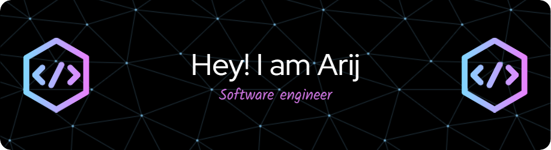

<h1 align="center">

  

 
   <strong> Hi there,i'm Arij Hajji welcome to my profile.</strong> 
 

</h1>

<h3 align="center">A passionate Web developer from Tunisia</h3>

- 🎓 I’m currently a Software Engineering Student at [ESPRIT : Ecole Sup Privée d'Ingénierie et de Technologies](https://esprit.tn/)

- 🌱 I’m currently looking for  **End of studies internship**

- 👯 I’m looking to collaborate on **new projects**

- 📫 How to reach me **arij.hajji@esprit.tn**

## 💎 My Values

💡 Mindset of Learning ,Curiosity & Digging up  
🙌 Teamwork & Communication  
🙋‍♂️ Autonomous  
🕺 & More to discover ...

<h3 align="left">Connect with me:</h3>

<h3 align="left">Languages ,Tools and DB:</h3> 

  
 
  

  

